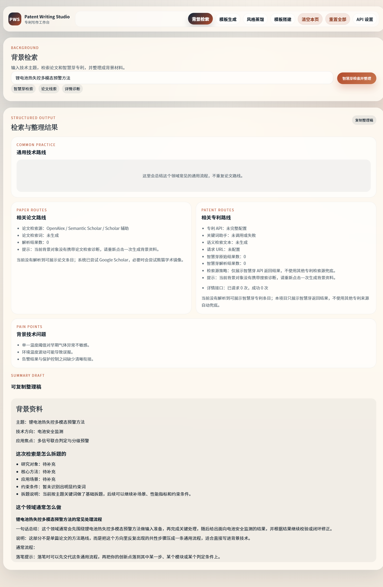
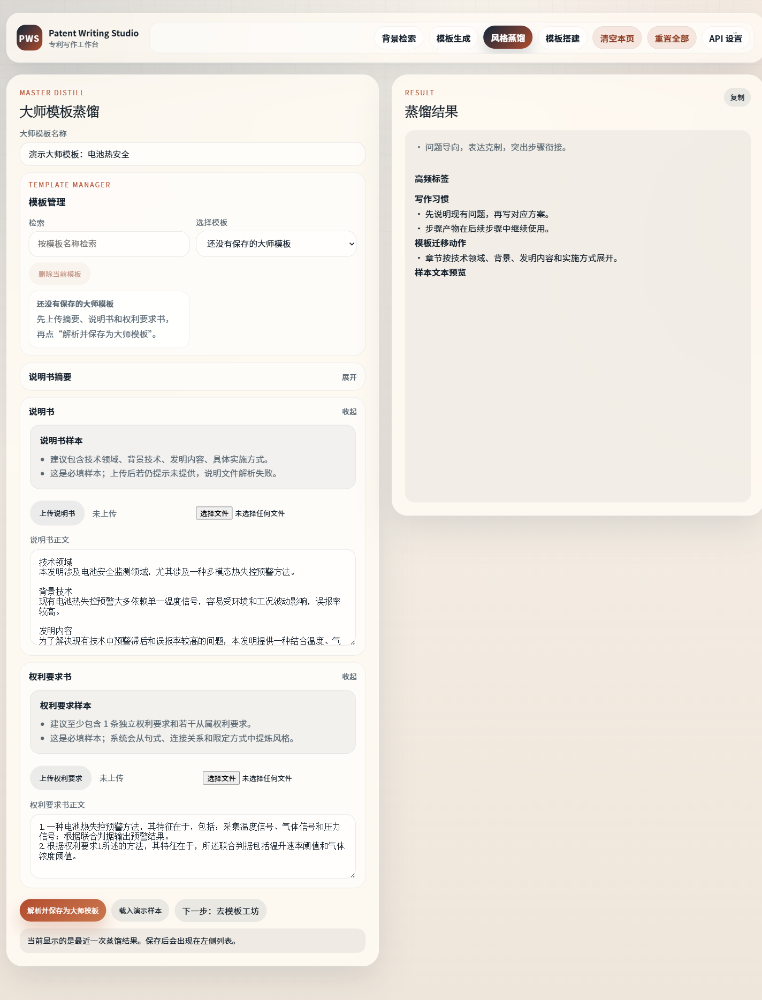
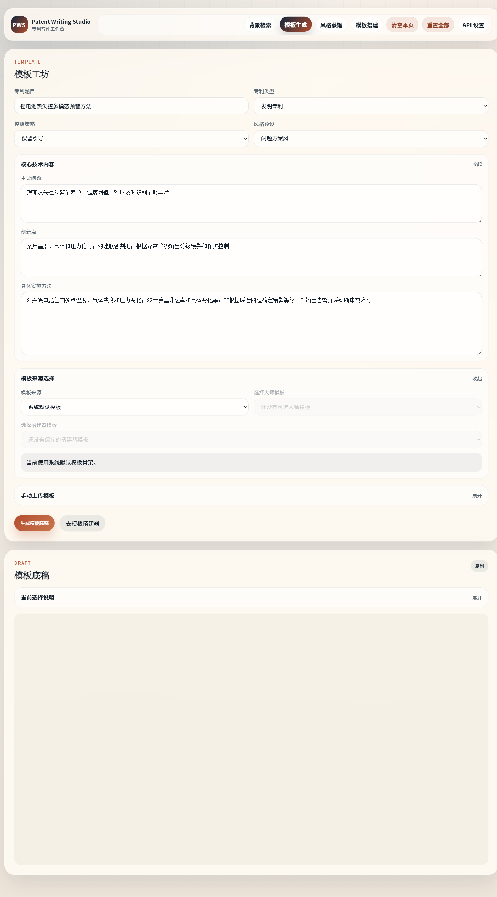
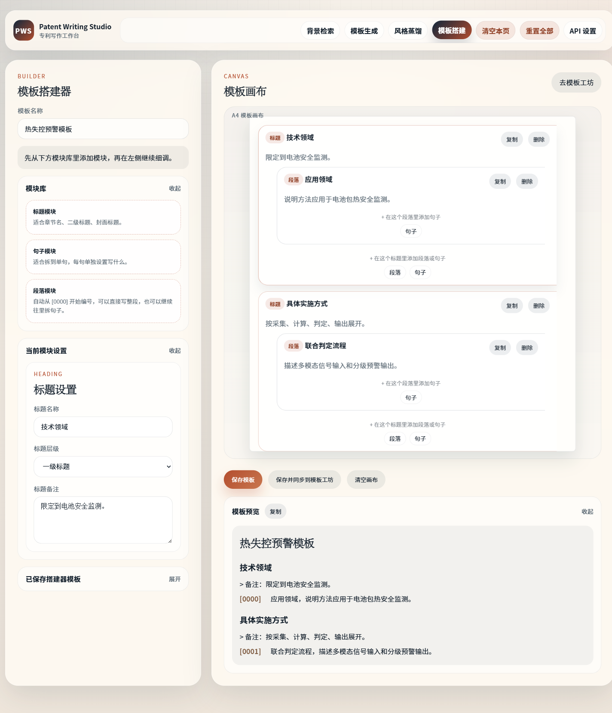

# Patent Writing Studio

Patent Writing Studio 是一个本地优先的专利写作辅助工具，用于整理检索入口、蒸馏写作风格、生成背景资料、搭建专利撰写模板，并提供持续对话式写作辅助。

这个版本不包含角色权限系统，适合个人本地使用和快速迭代。

## 功能概览

- 专利检索入口和检索词整理
- 写作风格蒸馏
- 背景资料生成
- 专利模板生成
- 智能助手对话
- 本地 API 设置与工作区状态保存

## 本地运行

```powershell
npm install
npm start
```

启动后打开：

```text
http://localhost:3036
```

## 常用命令

```powershell
npm test
npm run status
npm run stop
```

## 测试截图

以下截图来自本地浏览器中的实际用户操作路径，覆盖主要功能页面。

### 背景检索



### 风格蒸馏



### 模板生成



### 模板搭建



## 目录说明

- `public/`：前端页面
- `src/`：核心逻辑
- `scripts/`：端口管理等辅助脚本
- `tests/`：Node.js 测试
- `data/`：本地数据文件
